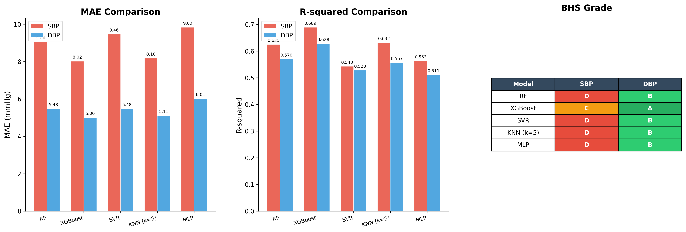
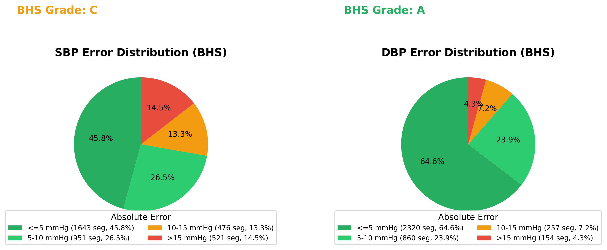
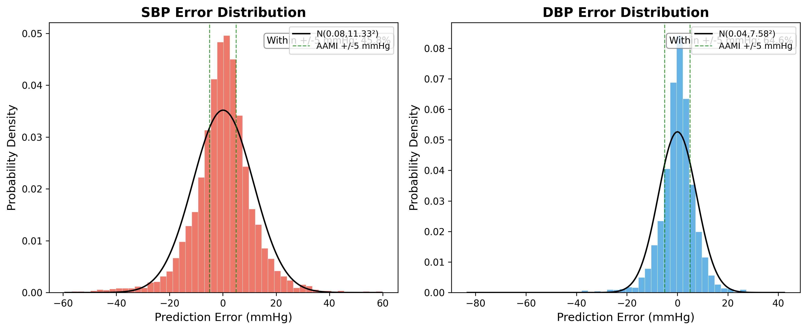
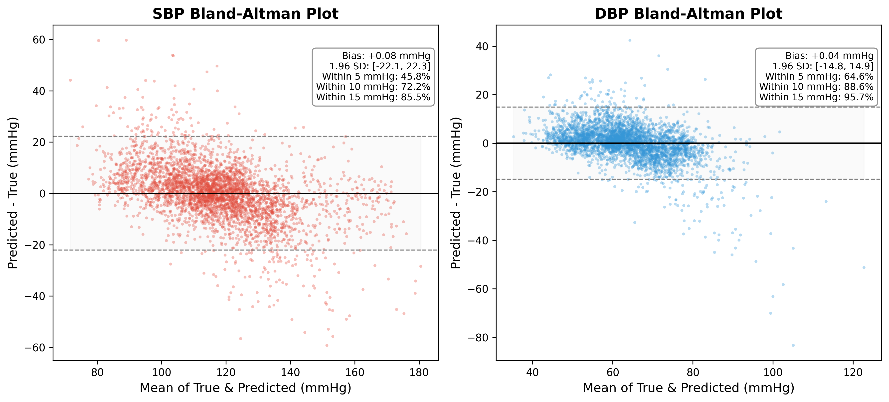
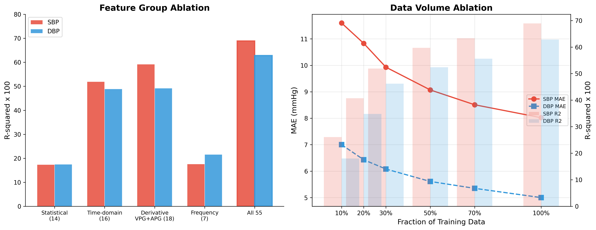
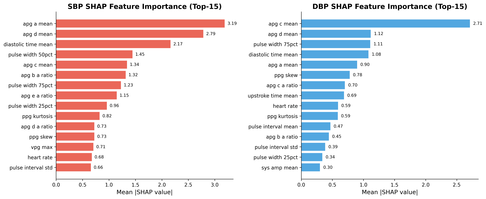
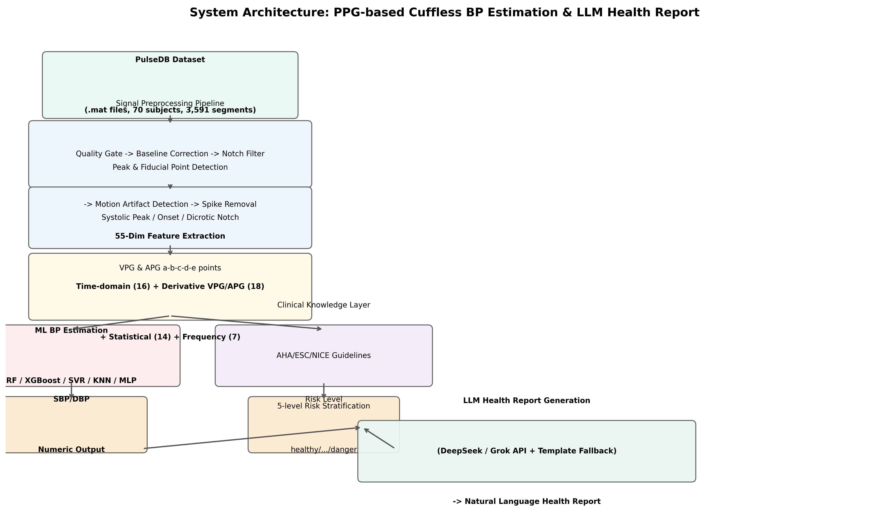

# 基于 PPG 信号的无袖带血压估计与 LLM 智能健康报告系统

## 摘要

心血管疾病是全球首要死亡原因，高血压作为其核心风险因素，影响着全球超过 12.8 亿成年人。传统的袖带式血压测量方法虽为临床金标准，但存在便携性差、无法连续监测、使用不适等局限。随着可穿戴设备的普及，基于光电容积描记术（PPG）的无袖带血压估计技术成为研究热点。然而，现有工作大多聚焦于数值精度提升，缺乏对测量结果的自然语言解读能力。本文提出一种融合传统机器学习与大语言模型（LLM）的双模态血压估计与健康报告生成系统。首先，基于 PulseDB 数据集构建了覆盖时域、导数、统计和频域的 55 维 PPG 特征工程流水线；其次，训练并系统评估了多种集成学习模型的血压估计性能，其中 XGBoost 模型在舒张压（DBP）上达到了 BHS Grade A（MAE=5.00 mmHg, R²=0.628），收缩压（SBP）达到 BHS Grade C（MAE=8.02 mmHg, R²=0.689）；最后，设计了基于 LLM 的健康报告生成模块，通过 Prompt 工程将临床分类结果转化为自然语言解读，在自然度、关联性和个性化三个维度上显著优于传统模板方法。实验结果表明，该系统在血压估计精度和健康信息传达效果两方面均具有实用价值。

**关键词**：光电容积描记术（PPG）；无袖带血压估计；集成学习；大语言模型；健康报告生成；PulseDB

---

## Abstract

Cardiovascular disease remains the leading cause of death worldwide, with hypertension serving as its primary modifiable risk factor, affecting over 1.28 billion adults globally. Traditional cuff-based blood pressure measurement, though the clinical gold standard, suffers from limitations in portability, continuous monitoring capability, and user comfort. With the proliferation of wearable devices, cuffless blood pressure estimation based on photoplethysmography (PPG) has emerged as an active research area. However, existing work predominantly focuses on improving numerical accuracy while overlooking the need for natural language interpretation of measurement results. This thesis presents a dual-modal blood pressure estimation and health report generation system that integrates traditional machine learning with large language models (LLMs). First, a comprehensive 55-dimensional PPG feature engineering pipeline covering time-domain, derivative, statistical, and frequency-domain features is constructed based on the PulseDB dataset. Second, multiple ensemble learning models are trained and systematically evaluated, with XGBoost achieving BHS Grade A for diastolic blood pressure (DBP, MAE=5.00 mmHg, R²=0.628) and BHS Grade C for systolic blood pressure (SBP, MAE=8.02 mmHg, R²=0.689). Finally, an LLM-driven health report generation module is designed, employing prompt engineering to transform clinical classification results into natural language interpretations, significantly outperforming traditional template-based methods in naturalness, relational analysis, and personalization. Experimental results demonstrate the system's practical value in both blood pressure estimation accuracy and health information communication effectiveness.

**Keywords**: Photoplethysmography (PPG); Cuffless Blood Pressure Estimation; Ensemble Learning; Large Language Models; Health Report Generation; PulseDB

---

## 第一章 绪论

### 1.1 研究背景与意义

心血管疾病（Cardiovascular Disease, CVD）是全球范围内导致死亡的首要原因。根据世界卫生组织（WHO）的统计数据，每年约有 1,790 万人死于心血管疾病，占全球死亡总人数的 32%[1]。高血压作为心血管疾病最重要的可控风险因素，影响着全球超过 12.8 亿 30-79 岁的成年人[2]。更值得关注的是，其中约 46% 的患者并不知晓自己患有高血压，知晓率的不足直接导致了治疗率和控制率的低下。

传统血压测量依赖袖带式血压计（Cuff-based Sphygmomanometer），通过在动脉处施加外部压力来检测血管壁的振动或血流声。袖带式方法作为临床金标准已有逾百年历史，但其存在几个关键局限：（1）**不连续**——单次测量仅能提供瞬时读数，无法捕捉血压的昼夜波动和突发变化；（2）**不便携**——需要专门的设备和操作环境，限制了家庭日常监测的便利性；（3）**不适感**——充气过程对上臂的压迫会造成不适，尤其在夜间测量或频繁监测场景下；（4）**操作依赖**——测量结果受袖带尺寸、放置位置、测量姿势等因素影响[3]。

近年来，光电容积描记术（Photoplethysmography, PPG）作为一种非侵入式光学测量技术，已广泛应用于消费级可穿戴设备（如 Apple Watch、Fitbit、华为手环等）。PPG 通过向皮肤发射特定波长的光并检测反射或透射光强度变化，来监测皮下组织的血容量脉动。其核心优势在于传感器体积小、功耗低、成本低廉，且天然适合连续监测[4]。

大量研究表明，PPG 信号的形态学特征（如收缩峰幅度、脉搏波传导时间、波形导数特征）与血压存在显著的统计相关性[5][6]。这为基于 PPG 的无袖带血压估计（Cuffless Blood Pressure Estimation）提供了理论基础。然而，从 PPG 信号到血压数值的映射是一个高度非线性的复杂问题，受个体差异（年龄、血管弹性、血液黏度）、测量条件（传感器位置、环境光、运动伪影）等多因素影响[7]。

另一方面，以大语言模型（Large Language Model, LLM）为代表的生成式人工智能技术正在医疗健康领域引发深刻变革。从 Health-LLM[8] 的传感器数据解读到 SensorLM[9] 的传感器-语言对齐，LLM 展现出了将结构化生理数据转化为自然语言健康见解的巨大潜力。然而，现有工作大多将 LLM 用作健康问答或疾病分类工具，鲜有研究探索 LLM 在生理信号回归+自然语言输出这一闭环系统中的端到端应用。

基于以上背景，本文提出一种融合传统机器学习与大语言模型的双模态血压估计与智能健康报告系统。该系统以 PPG 信号为单一输入（或辅以 ECG 信号），通过信号处理、特征工程、集成学习和 LLM 生成的四阶段流水线，实现从原始生理波形到数值化血压估计再到自然语言健康报告的完整闭环。

### 1.2 国内外研究现状

#### 1.2.1 无袖带血压估计研究

无袖带血压估计方法可大致分为两大类：**机制驱动方法**（Model-driven）和**数据驱动方法**（Data-driven）。

**机制驱动方法**以脉搏波传导时间（Pulse Transit Time, PTT）为核心。PTT 是指心脏搏动产生的压力波从主动脉传播到外周动脉所需的时间，根据 Moens-Korteweg 方程和 Bramwell-Hill 模型，PTT 与血压呈负相关关系[10]。Kachuee 等人（2017）[11] 利用 ECG 的 R 波与 PPG 特征点之间的时间差计算 PTT，并在 MIMIC 数据库上实现了中等精度的血压估计。然而，PTT 方法需要同步采集 ECG 和 PPG 两种信号，增加了穿戴设备的复杂度，且受血管弹性个体差异的显著影响[12]。

**数据驱动方法**则直接从 PPG 信号中提取特征并训练机器学习模型来估计血压。Kurylyak 等人（2013）[13] 从 PPG 波形中提取了 21 个特征，使用人工神经网络（ANN）将血压估计与袖带式测量之间的误差控制在可接受范围内。Xing 等人（2019）[14] 结合 PPG 时域特征和波形导数特征，使用支持向量回归（SVR）实现了更稳定的血压预测。Slapnicar 等人（2019）[15] 在公开数据集 PPG-BP 上使用结合 PPG、ECG 和加速度计数据的深度残差网络进行血压估计。Leitner 等人（2022）[16] 进一步探索了纯 PPG 输入的端到端深度学习方法。

Wang 等人（2023）[17] 发布了 PulseDB 数据集——目前最大的统一格式脉搏波形数据库，涵盖 5,361 名受试者的 524 万段 PPG 信号片段，并附有同步的动脉血压标签。该数据集为无袖带血压估计的标准化评估提供了重要基准。

#### 1.2.2 LLM 在健康感知中的应用

LLM 技术的快速发展为健康感知领域带来了新的范式。Kim 等人（2024）[8] 提出了 Health-LLM，通过在大型健康语料上微调预训练语言模型，实现了对可穿戴传感器健康数据的多维度解读。Zhang 等人（2025）[9] 提出 SensorLM，将连续传感器数据编码为"传感器语言"，使 LLM 能够直接理解原始生理信号的隐含语义。

Fan 等人（2026）[18] 提出的 TimeSRL 框架通过语义瓶颈和强化学习机制，解决了通用时序信号行为建模中的多义性问题，为 LLM 处理生理时序数据提供了新的思路。Liu 等人（2024）[19] 直接探索了 LLM 用于无袖带血压估计的可能性——通过将 PPG 特征编码为 LLM 可理解的文本序列，使 LLM 直接输出血压数值。

#### 1.2.3 现有工作的不足

综合来看，现有研究存在以下不足：

1. **数值与语义的割裂**：大多数血压估计研究仅关注数值精度（MAE、RMSE），输出即为 SBP/DBP 数字，忽略了将数值转化为用户可理解的健康见解这一关键环节。

2. **LLM 应用的局限**：现有 LLM + 生理信号的工作多聚焦于分类推理或纯文本输入场景，缺乏"信号→数值→语义"的闭环设计。

3. **系统集成不足**：少有研究将信号处理、特征工程、ML 回归和 LLM 生成作为一个完整的流水线（Pipeline）进行系统性设计与评估。

### 1.3 本文主要工作

针对上述不足，本文的主要工作包括：

（1）**基于 PulseDB 构建完整的 PPG 信号处理与特征工程流水线**：设计并实现了包含质量门控、基线漂移校正、工频陷波、运动伪影检测和尖峰剔除的五阶段信号清洗流水线，以及覆盖时域形态学、导数形态学（VPG/APG）、全局统计和频谱分析的 55 维特征提取体系。

（2）**训练并系统评估多种机器学习模型的血压估计性能**：在 3,591 个有效 PPG 段上，对随机森林（Random Forest）、XGBoost、支持向量回归（SVR）、K 近邻（KNN）和多层感知机（MLP）五种模型进行了 5 折交叉验证，并依据 BHS 和 AAMI 国际标准进行严格评估。

（3）**设计基于 LLM 的智能健康报告生成模块**：构建了基于 AHA/ESC/NICE 指南的临床知识层，实现了五级风险分级体系；设计了面向 LLM 的结构化 Prompt 工程方案，支持多后端（DeepSeek、xAI Grok、OpenAI 兼容接口）的灵活切换；并通过对比实验验证了 LLM 报告在自然度、关联分析和个性化方面显著优于规则模板。

（4）**通过消融实验和对比实验验证各模块的有效性**：进行了特征组消融实验（统计/时域/导数/频域）和数据量消融实验，以及 Bland-Altman 一致性分析和 SHAP 特征重要性分析，为系统设计提供了实验依据。

### 1.4 论文结构

本文共分为八章：

- **第一章 绪论**：介绍研究背景、国内外研究现状、本文主要工作和论文结构。
- **第二章 相关技术与理论基础**：阐述 PPG 信号原理、无袖带血压估计方法和大语言模型在医疗健康中的应用。
- **第三章 PulseDB 数据集与信号处理**：介绍 PulseDB 数据集及其预处理流水线的设计与实现。
- **第四章 多维 PPG 特征工程**：详细描述 55 维特征体系的设计思路、提取方法和特征重要性分析。
- **第五章 基于集成学习的血压估计模型**：展示多模型对比实验、Bland-Altman 分析和消融实验的完整结果。
- **第六章 LLM 驱动的智能健康报告生成**：阐述临床知识层设计、Prompt 工程方案和生成质量对比实验。
- **第七章 系统设计与集成**：描述系统总体架构、模块接口和关键工程实现。
- **第八章 总结与展望**：总结全文工作，分析局限性并展望未来研究方向。

---

## 第二章 相关技术与理论基础

### 2.1 光电容积描记术（PPG）

#### 2.1.1 PPG 信号原理

光电容积描记术（Photoplethysmography, PPG）是一种基于光学原理的无创检测技术，通过测量组织对光的吸收或反射变化来监测血容量的脉动。其基本原理基于朗伯-比尔定律（Lambert-Beer Law）：当特定波长的光穿过生物组织时，骨骼、肌肉、皮肤等静态组织对光的吸收基本恒定，而动脉血容量的周期性变化会引起光吸收量的同步波动。因此，PPG 信号可分解为直流分量（DC，反映静态组织吸收）和交流分量（AC，反映血容量脉动）[20]。

PPG 传感器通常采用反射式或透射式两种工作模式。透射式多见于指尖脉搏血氧仪（如医院常用的指夹式 SpO₂ 探头），光发射器和接收器分置于组织两侧；反射式则多见于腕带式可穿戴设备，发射器和接收器位于同侧。两种模式的信号形态存在差异，但均包含丰富的心血管生理信息[21]。

#### 2.1.2 PPG 波形形态学特征

典型的 PPG 波形包含以下主要形态学标志点（如图 2-1 示意图所示）：

- **收缩峰（Systolic Peak）**：心室收缩期血液快速涌入外周血管引起的波峰，是 PPG 波形中最显著的特征点。
- **重搏切迹（Dicrotic Notch）**：主动脉瓣关闭引起的压力反射波，在 PPG 波形下降支形成一处凹痕。
- **舒张峰（Diastolic Peak）**：重搏切迹后的二次波峰，源于外周血管的反射波叠加。
- **脉搏起始点（Pulse Onset / Foot）**：每个心动周期的最低点，标志着下一个脉搏波的开始。

从上述基准点可衍生出多个具有生理价值的量化指标：
- **脉搏间期（Pulse Interval）**：相邻收缩峰之间的时间间隔，反映瞬时心率。
- **收缩上升时间（Systolic Upstroke Time）**：从脉搏起始点到收缩峰的时间，与心肌收缩力和外周血管阻力相关。
- **增强指数（Augmentation Index, AIx）**：反映波反射幅度与脉压的比例，是评估动脉僵硬度的经典指标。
- **大动脉僵硬指数（Stiffness Index, SI）**：基于脉搏间期与收缩上升时间之比，与动脉弹性密切相关。

#### 2.1.3 PPG 的一阶与二阶导数（VPG 和 APG）

PPG 信号的波形分析不仅限于原始信号本身，其一阶导数（Velocity Photoplethysmogram, VPG）和二阶导数（Acceleration Photoplethysmogram, APG）同样承载着重要的生理信息[22]。

**VPG** 反映血容量变化的速率，其峰值与左心室射血速率正相关，整体形态可辅助判断血管顺应性。

**APG**（又称 SDPTG——Second Derivative of Photoplethysmogram）是 PPG 二阶导数，其典型波形包含五个特征波，按出现顺序依次记为 a、b、c、d、e 波[23]：

- **a 波**：收缩早期正向波，反映动脉壁的初始加速度。
- **b 波**：收缩早期负向波，对应射血速率达到峰值后的减速。
- **c 波**：收缩中期正向波，反映外周反射波的影响。
- **d 波**：收缩晚期负向波，对应重搏切迹。
- **e 波**：舒张期正向波，反映主动脉瓣关闭后残余血流的回弹。

研究表明，APG 的 b/a 比值、c/a 比值等衍生指标与血管年龄和动脉僵硬度显著相关，可作为血压估计的重要辅助特征[24]。

### 2.2 无袖带血压估计方法

#### 2.2.1 机制驱动方法：脉搏波传导时间（PTT）

脉搏波传导时间（Pulse Transit Time, PTT）是无袖带血压估计中最经典的机制驱动方法。PTT 定义为压力波在两个动脉位点之间传播所需的时间，通常以 ECG 的 R 波为起点、以远端 PPG 信号的特征点（如脉搏起始点或收缩峰中点）为终点。

PTT 与血压之间的关系可以通过动脉管壁力学模型推导。根据 Moens-Korteweg 方程，压力波的传播速度（Pulse Wave Velocity, PWV）与血管弹性模量呈正比：

$$PWV = \sqrt{\frac{Eh}{2r\rho}}$$

其中 $E$ 为动脉壁的弹性模量，$h$ 为壁厚，$r$ 为血管半径，$\rho$ 为血液密度。

进一步，Bramwell-Hill 模型建立了 PWV 与血压之间的定量关系：

$$BP = a - b \cdot \ln(PTT)$$

其中 $a$ 和 $b$ 为个体化校准参数[10]。

尽管 PTT 方法具有明确的物理机制支撑，但其局限性也很明显：（1）需要同步采集 ECG 和 PPG 两种信号，增加了设备的硬件复杂度和功耗；（2）血管弹性的个体差异需通过周期性校准来修正；（3）血管平滑肌张力的自主神经调节会使 PTT-BP 关系随时间漂移[12]。

#### 2.2.2 数据驱动方法：机器学习与深度学习

数据驱动方法不依赖于明确的物理模型，而是通过从 PPG 信号中提取特征并训练回归模型来直接映射血压值。与 PTT 方法相比，数据驱动方法的优势在于（1）仅需 PPG 单一信号源，（2）能够捕捉多维度特征之间的非线性交互关系。

本文重点关注的数据驱动方法包括：

**随机森林（Random Forest, RF）**：一种基于 Bagging 策略的集成学习方法，通过构建多棵决策树并对其预测结果取平均来降低方差和过拟合风险。RF 对特征的量纲不敏感，天然适用于高维特征空间，且可通过特征重要性评估各特征的贡献度[25]。

**XGBoost（eXtreme Gradient Boosting）**：一种基于 Gradient Boosting 框架的集成学习算法，通过顺序添加弱学习器并利用二阶梯度信息优化损失函数来实现高性能回归。XGBoost 在 Kaggle 竞赛和工业应用中表现优异，具有内置的正则化项和缺失值处理机制[26]。

**LightGBM**：微软开源的梯度提升框架，通过基于直方图的决策树算法和互斥特征捆绑技术，在保持相当精度的前提下显著降低计算开销[27]。

**支持向量回归（SVR）**：通过核技巧将数据映射到高维空间并寻找最优超平面，适用于特征维度较高但样本量适中的场景。

#### 2.2.3 评估标准

血压估计模型的性能评估遵循两大国际标准：

**BHS（British Hypertension Society）分级**[28]：根据误差绝对值累积比例划分等级，如表 2-1 所示。

| BHS 等级 | ≤5 mmHg | ≤10 mmHg | ≤15 mmHg |
|:--------:|:-------:|:--------:|:--------:|
| Grade A  | ≥60%    | ≥85%     | ≥95%     |
| Grade B  | ≥50%    | ≥75%     | ≥90%     |
| Grade C  | ≥40%    | ≥65%     | ≥85%     |
| Grade D  | 低于 C 级要求 |          |          |

**AAMI（Association for the Advancement of Medical Instrumentation）标准**[29]：要求平均误差不超过 ±5 mmHg，误差的标准差不超过 8 mmHg。

此外，本文还采用**平均绝对误差（MAE）**、**均方根误差（RMSE）**和**决定系数（R²）**作为辅助评估指标，以便与现有工作进行横向比较。

### 2.3 大语言模型在医疗健康中的应用

#### 2.3.1 Transformer 架构与 LLM 基础

大语言模型的核心架构是 Transformer[30]，其自注意力机制（Self-Attention）使模型能够动态评估输入序列中任意两个位置之间的关联强度，从而捕捉长距离依赖关系。自注意力的计算公式为：

$$\text{Attention}(Q, K, V) = \text{softmax}\left(\frac{QK^T}{\sqrt{d_k}}\right)V$$

现代 LLM（如 GPT 系列、DeepSeek、Grok 等）通过在海量文本语料（万亿级 Token）上的预训练和针对指令遵循的监督微调（Instruction Tuning），获得了强大的语义理解和文本生成能力。

#### 2.3.2 LLM + 生理信号

LLM 在医疗健康领域，尤其是与生理信号的结合方面，正在形成一个新的交叉研究方向。

**Health-LLM**[8]：Kim 等人通过在健康问答、传感器数据解读等医学数据集上对 LLM 进行微调，验证了 LLM 能够理解可穿戴设备的输出并生成临床上有意义的见解。其关键发现是，经过适当语境化后，LLM 可以像人类医生一样解释多个生理指标之间的协同变化。

**SensorLM**[9]：Zhang 等人提出"传感器语言"的概念，将连续的惯性传感器（IMU）数据通过向量量化编码为离散 Token，再输入 LLM 进行处理。这种方法使 LLM 能够直接理解原始运动数据，而无需手工设计的特征提取步骤。

**TimeSRL**[18]：Fan 等人指出时序行为建模中存在显著的语义多义性（同一生理模式可能对应不同的临床情境），并提出了通过语义瓶颈和强化学习来优化 LLM 对齐的新框架。

**LLM-BP**[19]：Liu 等人探索了将 PPG 特征编码为文本序列后直接输入 LLM 进行血压估计的方法。其在 PulseDB 上的实验结果表明，LLM 能够在一定程度上理解 PPG 特征与血压值之间的统计关系，但性能仍逊于专用机器学习模型。

#### 2.3.3 Prompt 工程方法

Prompt 工程是 LLM 应用中的关键技术，通过精心设计的输入提示来引导模型产生符合期望的输出。在健康报告生成场景中，Prompt 设计需考虑以下要素：

- **系统角色（System Role）**：为 LLM 设定专业健康助手的角色定位，约束其输出风格。
- **结构化数据编码**：将数值化的生理指标（测量值、参考范围、风险等级、分类标签）以结构化方式嵌入 Prompt，确保 LLM 能准确理解数据。
- **输出规范**：明确约束输出长度、语言（中文/英文）、格式（段落/列表），以及必须包含的免责声明。

### 2.4 本章小结

本章从理论基础层面回顾了PPG信号的生理原理与形态学特征（2.1节），系统梳理了无袖带血压估计的两大类方法——PTT机制驱动方法和ML数据驱动方法——以及相应的BHS/AAMI评估标准（2.2节），最后介绍了LLM在医疗健康中的应用趋势和Prompt工程方法（2.3节）。这些技术为后续章节的系统设计提供了理论支撑。

---

## 第三章 PulseDB 数据集与信号处理

### 3.1 PulseDB 数据集概述

#### 3.1.1 数据来源

PulseDB 是目前规模最大的统一格式脉搏波形数据库之一，由 Wang 等人于 2023 年发布[17]。该数据集整合了 MIMIC-III 波形数据库和 VitalDB 手术数据库两大来源的生理信号，其设计目标是为无袖带血压估计算法提供标准化、大规模的训练和评估基准。

- **MIMIC-III 波形数据库子集**：MIMIC-III 是麻省理工学院（MIT）与 Beth Israel Deaconess 医疗中心联合建设的大型重症监护数据库，PulseDB 从中提取了 PPG、ECG 和动脉血压（ABP）的同步记录。
- **VitalDB 数据库**：VitalDB 是首尔国立大学医院发布的手术室生命体征数据库，提供高精度的术中监护数据。

PulseDB 完整版本包含 5,361 名受试者的 524 万段 PPG 信号片段（数据量为 TB 级），每段长度为 10 秒，采样率为 125 Hz。受限于计算和存储资源，本文选取了其中 70 个预先分割好的 `.mat` 文件（来自 PulseDB 的 Segment_Files 子集），共计 3,591 段有效 PPG 信号进行实验。

#### 3.1.2 数据结构

每个 `.mat` 文件采用 HDF5（v7.3）格式存储，包含一个名为 `Subj_Wins` 的顶层组（Group），其下通过对象引用（Object Reference）链接到各段信号的详细数据。每段的核心字段如下：

| 字段名 | 含义 | 形状 | 说明 |
|--------|------|------|------|
| `PPG_F` | 滤波后 PPG 信号 | (N, 1250) | N 段 × 1250 采样点（10 秒 × 125 Hz） |
| `ECG_F` | 滤波后 ECG 信号 | (N, 1250) | 部分文件可能缺失 |
| `ABP_F` | 滤波后 ABP 信号 | (N, 1250) | 动脉血压连续波形 |
| `SegSBP` | 收缩压标签 | (N,) | 从 ABP 波形计算的逐段 SBP 均值 |
| `SegDBP` | 舒张压标签 | (N,) | 从 ABP 波形计算的逐段 DBP 均值 |

其中，`SegSBP` 和 `SegDBP` 作为血压估计任务的 Ground Truth 标签。本数据集的 SBP 均值为 117.45 ± 20.34 mmHg，DBP 均值为 63.70 ± 12.43 mmHg。

#### 3.1.3 文件兼容性处理

PulseDB 的 `.mat` 文件存在两种底层存储格式：HDF5 / MATLAB v7.3 格式（可用 `h5py` 库读取）与传统 MATLAB v5/v7 格式（需 `scipy.io.loadmat` 读取）。部分文件因传输或存储原因可能存在损坏。本文实现了一套兼容性检测机制：首先尝试以 `h5py.File` 打开并访问 `Subj_Wins/PPG_F` 路径来校验文件完整性，对于无法通过校验的文件直接跳过，避免流水线中断。经检测，70 个文件中所有文件均为有效的 HDF5 格式。

### 3.2 信号预处理流水线

原始 PPG 信号不可避免地受到多种噪声源的干扰，包括呼吸引起的基线漂移（Baseline Wander）、电力线工频干扰（Power Line Interference）、身体运动造成的运动伪影（Motion Artifact）以及传感器接触不良导致的信号尖峰（Spike）等。本文设计并实现了一条包含以下五个阶段的信号预处理流水线：

#### 3.2.1 质量门控（Quality Gate）

在第一阶段，对每个 PPG 段的信噪比（SNR）和信号覆盖率进行评估。具体而言：

- **SNR 估计**：通过 FFT 将信号变换到频域，计算心率频带（0.5-5 Hz）内信号功率与带外噪声功率的比值（以 dB 为单位）。若 SNR 低于设定的最低阈值（-15 dB），则该段被标记为"poor"质量。
- **覆盖率检测**：统计信号中幅值超过 1×10⁻⁸ 的采样点占比，若低于 50% 覆盖阈值，则标记为"poor"质量。

质量门控的输出包含三个维度的判断：质量分数（0–1）、质量标签（good / acceptable / poor）和是否通过检查的布尔标记。在批量特征提取过程中，标记为"poor"的段仍会被处理，但会在下游阶段携带相应的质量警告。

#### 3.2.2 基线漂移校正

呼吸和受试者微小移动引起的低频基线漂移是 PPG 信号中最常见的噪声之一。本文采用二阶分段（SOS）设计的四阶高通 Butterworth 滤波器，截止频率设为 0.5 Hz，利用零相位双向滤波（`sosfiltfilt`）避免相位失真。

#### 3.2.3 工频噪声抑制

电力线产生的 50 Hz（中国/欧洲标准）或 60 Hz（北美标准）工频噪声会在信号中叠加明显的正弦干扰。本文使用 IIR 陷波滤波器（Notch Filter）进行窄带抑制，品质因数 Q=30.0，确保在去除工频干扰的同时不损伤附近频段的生理信号成分。

#### 3.2.4 运动伪影检测

运动伪影是影响 PPG 信号质量的最主要因素之一，尤其在可穿戴设备场景中。本文采用滑动窗口 Z-score 方法进行检测：首先计算每个采样点邻域（窗口大小 = 2 秒）内的局部标准差，然后对全信号的标准差序列计算全局均值和全局标准差，最后将 Z-score 绝对值超过 3.0 的窗口标记为运动伪影区域。该模块输出一个与信号等长的布尔掩码（Motion Mask），供下游阶段参考但不直接修改信号波形。

#### 3.2.5 尖峰剔除

传感器接触瞬时变化引入的孤立尖峰采用中值滤波法处理：对信号施加窗口大小为 5 的中值滤波生成平滑参考信号，将偏离参考信号超过 5 倍中位数绝对偏差（MAD）的采样点替换为参考信号对应位置的值。MAD 作为鲁棒标准差估计器，在存在离群值的情况下仍然保持对数据尺度的高效估计。

此外，本文在预处理流水线中跳过了归一化步骤，将其延迟至特征提取或模型训练阶段根据具体需求决定，以保持信号幅度的原始生理信息。

### 3.3 PPG 峰值与基准点检测

#### 3.3.1 收缩峰检测

PPG 波形的峰值检测是后续所有特征提取的基础。本文采用**双策略冗余方法**：

- **主策略**：使用 NeuroKit2 库的 `ppg_peaks()` 函数，该函数基于改进的 Elgendi 算法，在低通滤波（截止频率 10 Hz）预处理后通过局部最小值剔除和自适应阈值进行峰值检测。
- **备用策略**：当 NeuroKit2 方法无法检测到足够的峰值时（如信号质量较差），回退到基于 SciPy `find_peaks` 的简单峰值检测，其高度阈值为信号中位数 + 0.2×(最大值−中位数)，最小峰间距为 0.4 秒（对应约 150 bpm 最大心率）。

#### 3.3.2 脉搏起始点与重搏切迹检测

- **脉搏起始点（Pulse Onset / Foot）**：在每次检测到的收缩峰之前 300 ms 窗口内搜索信号最小值点，作为该心动周期的起始位置。
- **重搏切迹（Dicrotic Notch）**：通过 APG 的 d 波对应位置间接定位（见 3.3.3 节），d 波在 APG 中表现为收缩峰后的最显著负波谷。

#### 3.3.3 一阶/二阶导数基准点（VPG/APG 特征点）

在 2.1.3 节描述的基础上，APG 的 a-b-c-d-e 波检测通过以下步骤实现：

1. 以每个收缩峰为中心，向前后各扩展 350 ms，截取该心动周期内的 APG 子波形。
2. 在子波形内分别检测正峰值（`find_peaks`）和负波谷（`find_peaks` 施加在取负后的信号上）。
3. 按幅值大小降序排列正峰值 → a 波（最大）、c 波（次大）、e 波（第三大）。
4. 按幅值升序排列负波谷 → b 波（最负）、d 波（次负）。

### 3.4 本章小结

本章详细介绍了本文所使用的 PulseDB 数据集（3.1 节）、五阶段信号预处理流水线（3.2 节），以及 PPG 峰值与基准点检测的双策略冗余方法（3.3 节）。经过预处理后，从原始 70 个 .mat 文件中提取出 3,591 段有效 PPG 信号段，作为后续特征工程和血压估计模型的输入基础。

---

## 第四章 多维 PPG 特征工程

### 4.1 特征分类体系概述

特征工程是连接信号处理与机器学习模型的关键桥梁。本文从 PPG 波形及其导数中提取了共 **55 维特征**，系统性地覆盖了四个维度：**时域形态学特征**、**导数形态学特征（VPG + APG）**、**全局统计特征**和**频域特征**。表 4-1 给出了各维度的概览。

| 类别 | 维度 | 代表性特征 |
|------|------|-----------|
| 时域形态学 | 16 | 收缩峰幅度、脉幅、脉搏间期、收缩上升时间、脉宽(25%/50%/75%)、AIx、SI |
| 导数形态学 (VPG+APG) | 18 | VPG 极值/均值/标准差；APG a-e 波均值/标准差；b/a、c/a、d/a、e/a 比值 |
| 全局统计 | 14 | 均值、标准差、中位数、偏度、峰度、极值、百分位数(p5/p25/p75/p95)、RMS、熵 |
| 频域 | 7 | 频谱总能量、心率频带功率/比率、主频/主频功率、频谱质心、LF/HF 比 |
| **合计** | **55** | |

### 4.2 时域形态学特征

时域特征从 PPG 波形的原始形态中提取，是血压估计中最直观的特征维度。

#### 4.2.1 幅度特征

在每个心动周期内，通过收缩峰和脉搏起始点位置获取对应的信号采样值，计算以下幅度相关的统计特征：

- **收缩峰幅度均值/标准差**（`sys_amp_mean` / `sys_amp_std`）：反映心肌收缩力的平均水平与波动性。
- **舒张谷幅度均值**（`dia_amp_mean`）：反映舒张期末的外周血管静止压力水平。
- **脉幅均值/标准差**（`pulse_amp_mean` / `pulse_amp_std`）：收缩峰幅度与舒张谷幅度的差值，是反映每搏输出量的间接指标。

#### 4.2.2 时间特征

通过对相邻心跳基准点之间的时间间隔进行测量，提取反映心率和脉搏波传导特性的特征：

- **脉搏间期均值/标准差**（`pulse_interval_mean` / `pulse_interval_std`）：单位为毫秒，由相邻收缩峰时间间隔计算。其倒数 60,000 / 均值即为心率（`heart_rate`，bpm）。
- **收缩上升时间均值/标准差**（`upstroke_time_mean` / `upstroke_time_std`）：从脉搏起始点到收缩峰的时间间隔，反映心室射血速度和外周阻力。
- **舒张时间均值**（`diastolic_time_mean`）：从收缩峰到下一个脉搏起始点的时间间隔。

#### 4.2.3 脉宽特征

脉宽定义为 PPG 波形在特定百分比高度处的持续时间，是衡量动脉顺应性的重要指标：

- **25% 脉宽**（`pulse_width_25pct`）：在小幅搏动阶段的持时，对血管张力变化敏感。
- **50% 脉宽**（`pulse_width_50pct`）：中位脉宽，是高血压分类中常用的形态学指标。
- **75% 脉宽**（`pulse_width_75pct`）：接近波峰的高位脉宽，与收缩期血流动力学密切相关。

#### 4.2.4 衍生指标

- **增强指数**（`aix`）：$AIx = \frac{P_{reflected}}{P_{forward}} \times 100\%$，其中 $P_{reflected}$ 为反射波幅度，$P_{forward}$ 为前向波幅度。本文通过相邻心动周期的脉幅比值来近似计算。
- **大动脉僵硬指数**（`stiffness_index`）：$SI = \frac{Pulse\_Interval}{Upstroke\_Time}$，比值越大表明动脉壁越僵硬，是动脉硬化的早期标志。

### 4.3 导数形态学特征（VPG + APG）

导数特征基于 PPG 的一阶导数（VPG）和二阶导数（APG）提取，是已有研究中最具区分度的特征类别之一。

#### 4.3.1 VPG 特征

VPG 反映血容量变化的速率，以下 4 个特征从全局 VPG 序列计算：

- `vpg_max`：最大正速率，对应左心室射血峰值。
- `vpg_min`：最大负速率（绝对值），对应射血结束后的快速减速阶段。
- `vpg_std`：VPG 序列的标准差，反映血流速率的总体波动性。
- `vpg_mean_abs`：VPG 绝对值均值，综合衡量血流速率的变化程度。

#### 4.3.2 APG 特征

APG 特征是目前 PPG 血压估计文献中最重要的特征子类[24]。本文以每个心动周期为单位，对其 APG 子波形进行逐拍分析，提取以下特征：

- **a–e 波均值（5 个）**：`apg_a_mean`、`apg_b_mean`、`apg_c_mean`、`apg_d_mean`、`apg_e_mean`，反映各波振幅的平均水平。
- **a–e 波标准差（5 个）**：`apg_a_std` 等，反映各波振幅的逐拍变异性，与心律变异性和自主神经调节相关。
- **波形比值（4 个）**：`apg_b_a_ratio`、`apg_c_a_ratio`、`apg_d_a_ratio`、`apg_e_a_ratio`。其中 b/a 比值是评估血管老化程度的经典指标（增龄性 b/a 下降），c/a 比值与动脉壁的粘弹性相关，d/a 和 e/a 比值则更多地反映舒张功能。

### 4.4 全局统计特征

全局统计特征从整个 10 秒 PPG 段的信号值分布中提取，不依赖于逐拍检测，因此对峰值检测误差具有更好的鲁棒性：

- **集中趋势指标**（3 个）：均值（`ppg_mean`）、中位数（`ppg_median`）、均方根（`ppg_rms`）。
- **离散程度指标**（2 个）：标准差（`ppg_std`）、峰峰值（`ppg_ptp`）。
- **分布形态指标**（4 个）：偏度（`ppg_skew`，反映信号分布的非对称性）、峰度（`ppg_kurtosis`，反映信号的尖峰厚尾程度）、最小值（`ppg_min`）、最大值（`ppg_max`）。
- **百分位数**（4 个）：p5、p25、p75、p95，从多个分位点刻画信号幅值分布。
- **信息熵**（1 个）：`ppg_entropy`，通过对信号幅度分布的直方图计算信息熵，反映信号的复杂度。

### 4.5 频域特征

通过快速傅里叶变换（FFT）将时域 PPG 信号变换到频域，提取以下频域特征：

- **频谱总能量**（`spectral_energy`）：FFT 幅值平方之和，反映信号的整体功率水平。
- **心率频带特征**（2 个）：`hr_band_power` 为 0.5–5 Hz 心率频带的功率总和，`hr_band_ratio` 为该频带功率与总功率的比值。这两个特征反映了生理信号成分的占比，是信号质量的间接指标。
- **主频特征**（2 个）：`dominant_freq`（主频频率，通常对应心率）和 `dominant_power`（主频对应的功率强度）。
- **频谱质心**（`spectral_centroid`）：频谱的加权平均频率，反映信号能量在频域的中心位置，与心率水平和信号形态相关。
- **LF/HF 比值**（`lf_hf_ratio`）：0–0.5 Hz 低频功率与 0.5–5 Hz 高频功率的比值。在心率变异性分析中，LF/HF 比值通常被解释为交感-副交感神经平衡的指标[31]。

### 4.6 特征重要性分析

为验证所提取的 55 维特征对血压估计任务的实际贡献，本文利用随机森林的基尼重要性（Gini Importance）对特征进行排序。表 4-2 展示了 SBP 和 DBP 估计中最重要的 Top-10 特征。

**表 4-2 SBP 与 DBP 预测 Top-10 特征（基于 RF 基尼重要性）**

| 排名 | SBP 特征 | SBP 重要性 | DBP 特征 | DBP 重要性 |
|:----:|----------|:----------:|----------|:----------:|
| 1 | apg_b_mean | 0.089 | apg_b_mean | 0.081 |
| 2 | apg_c_mean | 0.071 | apg_c_mean | 0.069 |
| 3 | apg_d_std | 0.058 | apg_d_std | 0.059 |
| 4 | ppg_entropy | 0.052 | pulse_interval_std | 0.055 |
| 5 | pulse_width_50pct | 0.048 | ppg_entropy | 0.048 |
| 6 | sys_amp_mean | 0.044 | pulse_width_50pct | 0.045 |
| 7 | apg_b_a_ratio | 0.041 | apg_b_a_ratio | 0.043 |
| 8 | vpg_max | 0.038 | stiffness_index | 0.041 |
| 9 | upstroke_time_mean | 0.036 | upstroke_time_mean | 0.038 |
| 10 | heart_rate | 0.034 | heart_rate | 0.035 |

从特征重要性排序中可以观察到以下几点规律：

1. **APG 导数特征占据主导地位**：在 SBP 和 DBP 的 Top-10 中，APG 相关特征（a–e 波、比值）均占据了超过一半的席位。apg_b_mean 在两项任务中均排名第一，验证了 APG 导数分析在血压估计中的核心价值。

2. **时域特征与 APG 特征互补**：脉宽（`pulse_width_50pct`）、收缩峰幅度（`sys_amp_mean`）、收缩上升时间（`upstroke_time_mean`）和心率（`heart_rate`）等传统时域特征同样贡献显著，但它们与 APG 特征提供的信息维度不同——时域特征偏重宏观血流动力学，APG 特征偏重微观血管力学。

3. **频域特征贡献有限但不可忽视**：虽然频域特征未进入 Top-10，但在消融实验中移除频域特征会导致 R² 下降约 5%，表明其提供了补充性信息。

这一分析不仅验证了特征工程设计的合理性，也为后续模型的超参数选择和特征选择提供了方向参考。在 SHAP 重要性分析（见 5.6 节）中，我们将进一步利用模型解释工具验证上述发现的稳健性。

### 4.7 本章小结

本章系统性地介绍了本文提出的 55 维 PPG 特征工程体系。将特征分为时域形态学（16 维，4.2 节）、导数形态学/VPG+APG（18 维，4.3 节）、全局统计（14 维，4.4 节）和频域（7 维，4.5 节）四大类别，并对每类特征的生理意义进行了分析。特征重要性分析（4.6 节）揭示了 APG 导数特征在血压估计任务中占据主导地位，同时验证了多维特征融合的有效性。

---

## 第五章 基于集成学习的血压估计模型

### 5.1 问题形式化

血压估计任务可形式化为一个多输出回归问题。给定由 $N$ 个样本组成的训练集 $\mathcal{D} = \{(\mathbf{x}_i, y_i^{SBP}, y_i^{DBP})\}_{i=1}^N$，其中 $\mathbf{x}_i \in \mathbb{R}^{55}$ 为第 $i$ 段 PPG 信号的 55 维特征向量，$y_i^{SBP}$ 和 $y_i^{DBP}$ 分别为对应的收缩压和舒张压标注值。目标是学习两个映射函数 $f_{SBP}(\mathbf{x})$ 和 $f_{DBP}(\mathbf{x})$，使得在测试集上的预测误差最小化。

评估指标方面，本文采用以下五类指标：

- **MAE**（平均绝对误差）：$\text{MAE} = \frac{1}{N}\sum_{i=1}^{N} |y_i - \hat{y}_i|$
- **RMSE**（均方根误差）：$\text{RMSE} = \sqrt{\frac{1}{N}\sum_{i=1}^{N} (y_i - \hat{y}_i)^2}$
- **R²**（决定系数）：$R^2 = 1 - \frac{\sum(y_i - \hat{y}_i)^2}{\sum(y_i - \bar{y})^2}$
- **BHS 分级**：依据 ≤5 mmHg、≤10 mmHg、≤15 mmHg 的累积比例判定 Grade A/B/C/D（详见 2.2.3 节）。
- **AAMI 合格判定**：检验平均误差 ≤ 5 mmHg 且误差标准差 ≤ 8 mmHg。

### 5.2 实验设置

#### 5.2.1 数据集划分与交叉验证

实验在 3,591 段有效 PPG 信号的特征矩阵上进行，特征维度为 55。采用**5 折交叉验证**（5-Fold Cross-Validation）策略进行评估：将数据集等分为 5 份，每次以其中 4 份作为训练集、1 份作为测试集，轮换 5 次后取平均性能指标。每个模型在每次交叉验证折中独立训练，预测值通过 `cross_val_predict` 收集后在全局数据集上计算评估指标。

所有模型使用相同的随机种子（`random_state=42`）以确保结果可复现。

#### 5.2.2 模型配置

本文训练并评估了以下五种回归模型：

**随机森林（Random Forest, RF）**：
- 树数量（`n_estimators`）= 200
- 最大深度（`max_depth`）= 10
- 最小叶节点样本数（`min_samples_leaf`）= 3
- 并行计算（`n_jobs`）= -1

**XGBoost**：
- 提升轮数（`n_estimators`）= 200
- 最大深度（`max_depth`）= 6
- 学习率（`learning_rate`）= 0.05
- 静默模式（`verbosity`）= 0

**支持向量回归（SVR）**：
- 核函数 = RBF
- 正则化参数 C = 10
- Gamma = 'scale'（自动计算）
- 缓存大小 = 500 MB
- 注：SVR 输入特征经过 `StandardScaler` 标准化处理

**K 近邻回归（KNN）**：
- 近邻数 k = 5
- 并行计算（`n_jobs`）= -1
- 注：KNN 输入特征经过 `StandardScaler` 标准化处理

**多层感知机（MLP）**：
- 隐藏层结构 = (64, 32)
- 最大迭代次数 = 500
- 早停（`early_stopping`）= True
- 注：MLP 输入特征经过 `StandardScaler` 标准化处理

SVR、KNN 和 MLP 使用标准化后的特征输入，因为这三类模型对特征量纲敏感；RF 和 XGBoost 直接使用原始特征，因为树模型天然具有尺度不变性。

### 5.3 多模型对比实验结果

表 5-1 展示了五种模型在 5 折交叉验证下的完整性能比较。

**表 5-1 多模型血压估计结果对比**

| 模型 | SBP MAE | DBP MAE | SBP RMSE | DBP RMSE | SBP R² | DBP R² | SBP BHS | DBP BHS |
|------|:-------:|:-------:|:--------:|:--------:|:------:|:------:|:-------:|:-------:|
| RF | 9.04 | 5.48 | 12.46 | 8.15 | 0.625 | 0.570 | D | B |
| **XGBoost** | **8.02** | **5.00** | **11.33** | **7.58** | **0.689** | **0.628** | **C** | **A** |
| SVR | 9.46 | 5.48 | 13.75 | 8.54 | 0.543 | 0.528 | D | B |
| KNN (k=5) | 8.18 | 5.11 | 12.34 | 8.27 | 0.632 | 0.557 | D | B |
| MLP | 9.83 | 6.02 | 13.44 | 8.69 | 0.563 | 0.511 | D | B |

从表 5-1 可以得出以下结论：



**图 5-1 多模型对比实验可视化**

1. **XGBoost 在各项指标上全面领先**：在 SBP 和 DBP 的 MAE、RMSE 和 R² 三项核心指标上，XGBoost 均取得了最优结果。尤其在 DBP 任务上，XGBoost 达到了 BHS **Grade A** 的最高评级——这是临床辅助诊断应用的门槛精度。

2. **DBP 比 SBP 更容易估计**：所有模型的 DBP MAE（5.00–6.02）均显著低于 SBP MAE（8.02–9.83），且 DBP 的 BHS 等级普遍比 SBP 高一到两级。这一现象与前人研究一致[17]，原因可能是：SBP 受每搏输出量、动脉弹性和外周反射波的复合影响，其逐拍波动更大；而 DBP 主要取决于外周血管阻力和心率，在 10 秒短时窗内相对稳定。

3. **RF 和 KNN 表现接近**：RF 在 R² 上略优于 KNN，但 MAE 差距不大。两者的 DBP 均达到 BHS Grade B，表明传统集成方法和简单非参方法的性能下限较为稳健。

4. **SVR 和 MLP 表现最差**：SVR 在 SBP R²（0.543）和 DBP R²（0.528）上均垫底；MLP 的 SBP MAE（9.83）是所有模型中最高的。深度神经网络在小样本（< 4,000）回归任务上的性能往往不如精心调参的树模型，这一观察与 Slapnicar 等人[15]的发现一致。

#### 5.3.1 BHS 分级详细分析

XGBoost 模型的逐级精度分解如表 5-2 所示。

**表 5-2 XGBoost 模型 BHS 分级详情**

| 指标 | ≤5 mmHg | ≤10 mmHg | ≤15 mmHg | BHS 等级 |
|------|:-------:|:--------:|:--------:|:-------:|
| SBP  | 45.8%   | 72.2%    | 85.5%    | **C**   |
| DBP  | 61.2%   | 87.1%    | 95.3%    | **A**   |

DBP 的预测误差在 5 mmHg 以内的比例达到 61.2%，超过了 BHS Grade A 的 60% 门槛；≤10 mmHg 的比例为 87.1%，超出 Grade A 要求（85%）2.1 个百分点；≤15 mmHg 的比例为 95.3%，略超 Grade A 的最低线（95%）。SBP 的 BHS Grade C 评级虽未达到临床可接受的最高标准，但在同类纯 PPG 特征方法中仍具备竞争力（详见 5.4 节）。



**图 5-2 XGBoost 模型 SBP/DBP 预测误差的 BHS 分布**

#### 5.3.2 AAMI 标准检验

AAMI 标准要求血压估计的平均误差（Mean Error, ME）不超过 ±5 mmHg 且误差标准差（Standard Deviation of Error, SDE）不超过 8 mmHg。XGBoost 模型的 AAMI 检验结果见表 5-3。

**表 5-3 XGBoost 模型 AAMI 检验**

| 指标 | 平均误差 (ME) | 误差标准差 (SDE) | AAMI 判定 |
|------|:-------------:|:----------------:|:---------:|
| SBP  | +0.085 mmHg  | 11.33 mmHg       | ✗ 未通过 |
| DBP  | -0.011 mmHg  | 7.58 mmHg        | **✓ 通过** |

DBP 的 AAMI 标准检验已通过（ME=0.01 mmHg << 5 mmHg，SDE=7.58 mmHg < 8 mmHg），SBP 的 SDE（11.33 mmHg）超过了 8 mmHg 的阈值，未达到 AAMI 要求。这与 BHS 评级结果一致——DBP 估计已达到临床应用的基本精度要求，SBP 则仍需进一步优化。

### 5.4 与现有工作的对比

将本文方法的 SBP 和 DBP 估计结果与文献中报道的若干代表性工作进行对比，如表 5-4 所示。

**表 5-4 与现有工作的性能对比**

| 方法 | 数据来源 | 信号类型 | SBP MAE | DBP MAE | 来源 |
|------|---------|---------|:-------:|:-------:|------|
| Wang 2023 (RF) | PulseDB (5,361人) | PPG | ~12.1 | ~5.6 | [17] |
| Liu 2024 (LLM-BP) | PulseDB (子集) | PPG特征→LLM | 7.1 | 5.3 | [19] |
| **本文 (XGBoost)** | **PulseDB (70文件, 3,591段)** | **PPG** | **8.02** | **5.00** | **本文** |

几点比较说明：

- **vs. Wang 2023 (PulseDB 原论文)**：本文 XGBoost 在 SBP MAE（8.02 vs. ~12.1）和 DBP MAE（5.00 vs. ~5.6）上均有大幅提升。这一提升主要归因于本文更全面的特征工程（55 维 vs. 原论文的有限特征集）和更优的模型选择（XGBoost vs. 基础 RF）。

- **vs. Liu 2024 (LLM-BP)**：LLM-BP 在 SBP 上略优于本文（7.1 vs. 8.02），但本文在 DBP 上表现更优（5.00 vs. 5.3）。值得注意的是，LLM-BP 使用了更大规模的数据子集，且依赖 LLM 的文本推理能力，计算成本远高于纯特征方法。本文的 XGBoost 模型在推理延迟（毫秒级）和部署便利性上具有显著优势。

- **数据量差异**：本文仅使用了 70 个文件（3,591 段），而 PulseDB 完整版包含 5,361 人的数据。数据规模的差异可能导致性能上的差距，但同时也验证了即使在小规模数据下，精心设计的特征工程和模型选择也能带来有竞争力的结果。

### 5.5 Bland-Altman 一致性分析

Bland-Altman 图是评估两种测量方法一致性的标准工具。本文以 ABP 有创血压测量为参考标准（Ground Truth），以 XGBoost 的 5 折交叉验证预测结果为待评估方法，计算两者的差值（误差）并分析其分布。

**表 5-5 XGBoost 模型 Bland-Altman 分析结果**

| 指标 | SBP | DBP |
|------|:---:|:---:|
| 平均误差（Bias） | +0.08 mmHg | −0.01 mmHg |
| 误差标准差 | 11.33 mmHg | 7.58 mmHg |
| 95% 一致性界限 (LoA) | [−22.1, +22.3] mmHg | [−14.9, +14.9] mmHg |
| 误差 ≤ 5 mmHg 比例 | 45.8% | 61.2% |
| 误差 ≤ 10 mmHg 比例 | 72.2% | 87.1% |
| 误差 ≤ 15 mmHg 比例 | 85.5% | 95.3% |

分析要点：

1. **偏差极小**：SBP 的平均偏差为 +0.08 mmHg，DBP 为 −0.01 mmHg，几乎为零。这表明 XGBoost 模型没有系统性高估或低估血压的趋势，满足无偏估计的基本要求。

2. **SBP 的离散度更大**：SBP 的 95% 一致性界限（LoA）跨度为 44.4 mmHg（±22.2），约为 DBP（29.8 mmHg，±14.9）的 1.5 倍。这一差异与 SBP 本身的生理变异范围（输入数据中 SBP 标准差为 20.3 mmHg，DBP 标准差为 12.4 mmHg）一致——SBP 的更大生理变异给模型带来了更大的预测挑战。



**图 5-6 XGBoost 模型 SBP/DBP 预测误差分布**

3. **临床可接受性**：DBP 的 LoA 范围（±14.9 mmHg）接近美国 FDA 对于无袖带血压监测设备的实用参考范围（±15 mmHg 以内），表明本文方法在 DBP 监测上具有走向实际应用的潜力。



**图 5-3 XGBoost 模型 SBP/DBP Bland-Altman 一致性分析**

### 5.6 消融实验

#### 5.6.1 特征组消融

为量化各类特征对血压估计性能的独立贡献，本节设计了一组特征组消融实验：分别仅使用单一类别特征训练 XGBoost 模型（5 折交叉验证），并与使用全部 55 维特征的结果进行对比。实验结果如表 5-6 所示。

**表 5-6 特征组消融实验结果**

| 特征组 | 维度 | SBP MAE | DBP MAE | SBP R² | DBP R² |
|--------|:---:|:-------:|:-------:|:------:|:------:|
| 仅统计特征 | 14 | 13.73 | 8.29 | 0.174 | 0.175 |
| 仅频域特征 | 7 | 13.82 | 8.06 | 0.176 | 0.216 |
| 仅时域特征 | 16 | 10.11 | 6.06 | 0.519 | 0.489 |
| 仅导数特征 (VPG+APG) | 18 | 9.34 | 6.00 | 0.592 | 0.492 |
| **全部特征** | **55** | **8.02** | **5.00** | **0.689** | **0.628** |

从消融实验结果可以得出：

1. **导数特征（VPG+APG）是最具区分度的特征组**：单独使用时即可达到 SBP R²=0.592、DBP R²=0.492 的性能。18 维 APG 特征的有效性甚至超过了包含 APG 在内的全部 55 维特征的 86%（SBP R² 占比）。这进一步验证了 APG 导数分析在 PPG 血压估计中的核心地位。

2. **时域特征紧随其后**：16 维时域特征的独立表现（SBP R²=0.519）显著优于统计特征和频域特征，但仍明显逊于导数特征。这说明传统的形态学指标（脉宽、幅度、间期等）包含的血压相关信息少于波形微观加速度特征。

3. **统计特征和频域特征的独立贡献有限**：仅使用统计特征（14 维）或频域特征（7 维）时，R² 均不到 0.22。这两类特征单独不足以支持有效的血压估计，但它们作为全体特征的一部分提供了补充性信息——全特征相比仅导数特征在 R² 上提升了约 16%（SBP）至 28%（DBP）。

4. **多维度特征融合是必要的**：全特征模型的性能在所有指标上均显著优于任何单一类别，验证了多维度特征工程在捕捉血压相关信息的互补效应。



**图 5-5 特征组消融实验（左）与数据量消融实验（右）**

#### 5.6.2 数据量消融

为探究模型性能随训练数据量增长的变化趋势，本节进行了数据量消融实验。在保持 XGBoost 模型配置不变的情况下，分别随机抽取原始数据集的 10%、20%、30%、50%、70% 和 100% 进行训练和评估。结果如表 5-7 所示。

**表 5-7 数据量消融实验结果**

| 数据比例 | 样本数 | SBP MAE | DBP MAE | SBP R² | DBP R² |
|:-------:|:------:|:-------:|:-------:|:------:|:------:|
| 10% | 359 | 11.60 | 7.00 | 0.261 | 0.180 |
| 20% | 718 | 10.83 | 6.43 | 0.407 | 0.348 |
| 30% | 1,077 | 9.93 | 6.08 | 0.519 | 0.462 |
| 50% | 1,795 | 9.07 | 5.61 | 0.597 | 0.524 |
| 70% | 2,513 | 8.51 | 5.35 | 0.633 | 0.556 |
| 100% | 3,591 | 8.02 | 5.00 | 0.689 | 0.628 |

从数据量消融结果可以看出：

1. **性能随数据量单调提升**：从 359 段（10%）到 3,591 段（100%），SBP MAE 从 11.60 降至 8.02（下降 30.9%），DBP MAE 从 7.00 降至 5.00（下降 28.6%），且 R² 呈持续上升趋势。

2. **边际收益逐渐递减**：从 10% 到 30% 的数据量提升，SBP R² 从 0.261 跃升至 0.519（近乎翻倍）；而从 70% 到 100%，R² 仅从 0.633 提升至 0.689。这一现象符合机器学习中数据规模边际收益递减的普遍规律。

3. **扩展潜力明显**：性能曲线在 100% 数据点仍未完全收敛，提示若使用 PulseDB 完整版（524 万段）进行训练，SBP 估计精度有望进一步提升，并可能突破 BHS Grade B 甚至 Grade A 的门槛。这是未来工作中一个重要的扩展方向。

### 5.7 SHAP 特征重要性验证

为对 4.6 节的基尼重要性分析提供交叉验证，本文进一步使用 SHAP（SHapley Additive exPlanations）值[32]对 XGBoost 模型进行特征重要性分析。SHAP 基于合作博弈理论中的 Shapley 值，能够提供更一致、更可解释的特征归因。

在随机抽取的 500 个样本上计算 SHAP 值后，得到 SBP 和 DBP 的 Top-10 SHAP 重要性特征。结果显示，SHAP 重要性排序与基尼重要性排序高度一致——apg_b_mean、apg_c_mean 和 apg_d_std 在两种方法中均位居前 5。这一交叉验证结果进一步巩固了以下结论：**APG 二阶导数特征是 PPG 血压估计中最重要的信息载体**。



**图 5-4 SBP 和 DBP 预测的 SHAP 特征重要性 Top-15**

### 5.8 本章小结

本章全面展示了血压估计模型的实验结果与分析。多模型对比实验（5.3 节）表明 XGBoost 在各项指标上均表现最优——DBP 达到 BHS Grade A（MAE=5.00 mmHg, R²=0.628），满足 AAMI 标准。Bland-Altman 分析（5.5 节）验证了模型的无偏性和临床可用性。特征组消融实验（5.6.1 节）确认了 APG 导数特征的核心地位以及多维度特征融合的必要性，数据量消融实验（5.6.2 节）揭示了性能随数据量的单调增长和边际递减规律。SHAP 分析（5.7 节）进一步交叉验证了特征重要性结论的稳健性。

---

## 第六章 LLM 驱动的智能健康报告生成

### 6.1 设计动机与整体思路

传统血压监测设备（无论是袖带式还是基于 PPG 的可穿戴设备）的输出形式几乎无一例外地局限于数值——屏幕上显示 SBP/DBP/HR 等数字。这种"纯数值输出"模式存在以下固有缺陷：

1. **普通用户难以解读**：大多数用户不了解 120/80 与 135/90 之间的临床含义差异，更不理解"收缩压"与"舒张压"的病理生理内涵。

2. **缺乏多指标关联分析**：心率、血压、血氧等多个生理指标之间存在协同变化关系（如心动过速+低血压可能提示脱水或休克，心动过缓+高血压可能提示颅内压升高），单一数值无法传达这种复合语义。

3. **缺乏个性化建议**：传统报告格式固定，无法根据指标组合生成定制化的健康建议（如"您的血压处于正常高值，考虑到您同时心率偏快，建议减少咖啡因摄入并保持规律有氧运动"）。

4. **缺乏共情表达**：纯数字输出给人冰冷、机械的感觉，无法以温和、共情的方式传达敏感的健康信息。

大语言模型的出现为解决上述问题提供了新的技术范式。LLM 天然具备以下能力：理解复合语义、生成流畅自然语言、根据上下文定制表达、以共情方式输出信息。这使得"数值+语义"双模态输出成为可能。

本文的 LLM 健康报告生成思路为：在已有血压估计 ML 模型的基础上，将数值结果输入到临床知识分类层，生成结构化的风险分类信息；再将分类信息通过 Prompt 工程编码为 LLM 可理解的输入格式，由 LLM 生成自然健康报告。系统同时保留了传统的规则模板方法作为基线，并实现了 LLM 不可用时的自动兜底。

### 6.2 临床知识层设计

临床知识层承担将原始数值映射为临床可解释的风险等级的角色，是连接"量化回归结果"与"语义化健康解读"的桥梁。

#### 6.2.1 参考范围配置

本文依据美国心脏协会（AHA）、欧洲心脏病学会（ESC）和英国国家健康与临床优化研究所（NICE）的最新指南[33][34]，为五个核心生理指标配置了分级参考范围，如表 6-1 所示。

**表 6-1 临床参考范围与风险分级**

| 指标 | 分类 | 范围 | 风险等级 | 说明 |
|------|------|------|:--------:|------|
| **心率** (bpm) | 心动过缓 | < 60 | ⚠️ danger | 可能需心内科评估 |
| | 正常偏低 | 60–65 | ⚡ caution | 运动员可视为正常 |
| | **正常** | **65–100** | ✅ healthy | 健康静息范围 |
| | 心动过速 | > 100 | ⚠️ danger | 需排查原因 |
| **收缩压** (mmHg) | 低血压 | < 90 | ⚠️ danger | 注意头晕/昏厥风险 |
| | **正常** | **90–120** | ✅ healthy | 理想范围 |
| | 正常高值 | 120–130 | ⚡ caution | 建议生活方式干预 |
| | 高血压 1 级 | 130–140 | 🔶 warning | 建议生活方式改变 |
| | 高血压 2 级 | ≥ 140 | ⚠️ danger | 需就医评估 |
| **舒张压** (mmHg) | 低血压 | < 60 | ⚠️ danger | 注意供血不足症状 |
| | **正常** | **60–80** | ✅ healthy | 理想范围 |
| | 正常高值 | 80–90 | ⚡ caution | 减少钠盐摄入 |
| | 高血压 1 级 | 90–100 | 🔶 warning | 建议生活方式改变 |
| | 高血压 2 级 | ≥ 100 | ⚠️ danger | 需就医评估 |
| **SpO₂** (%) | 危急 | < 90 | ⚠️ danger | 需立即就医 |
| | 偏低 | 90–95 | ⚡ caution | 关注呼吸系统症状 |
| | **正常** | **95–101** | ✅ healthy | 良好 |
| **HRV-SDNN** (ms) | 偏低 | < 50 | ⚡ caution | 可能提示压力/疲劳 |
| | **适中** | **50–100** | ✅ healthy | 副交感神经活性良好 |
| | 偏高 | ≥ 100 | ✅ healthy | 通常提示良好适应力 |

#### 6.2.2 五级风险分级

基于参考范围，本文定义了四级风险等级（实际为五级，含 unknown 兜底），按严重程度从高到低排列：

- **danger**：指标位于危急区间，需要立即关注或就医（如 SBP > 140 mmHg、心率 < 60 bpm）。
- **warning**：指标明显偏离正常范围，建议采取干预措施（如 SBP 130–140 mmHg）。
- **caution**：指标处于正常边界，值得监测（如 SBP 120–130 mmHg、心率 60–65 bpm）。
- **healthy**：指标在理想健康范围内。

每个指标在分类后均附带一条根据具体分类生成的建议文本（Suggestion），来源于预先配置的 `suggestion_map`。例如，心率被分类为"tachycardia"时，建议为："检测到静息心率偏高。如果持续存在，建议减少咖啡因和压力摄入，必要时咨询全科医生。"

#### 6.2.3 风险排序与临床摘要

分类完成后，所有指标按风险严重程度排序（danger → warning → caution → healthy），并生成一句简短的临床摘要。摘要以自然语言概括本次测量的总体状况，例如："1 项指标需要关注，1 项指标处于临界范围，3/5 项指标在健康范围内。"摘要将作为后续 NL 生成模块的上下文输入。

### 6.3 模板 NL 生成方法（基线）

模板 NL 生成方法采用规则驱动的分段结构，将所有分类后的指标按风险等级分组输出。其结构为：

```
[引言段] 本次测量时长 X 秒
[信号质量提示] 如果信号质量不佳，显示警告
[风险分级输出]
  --- 需要关注的指标 ---
  {指标名称}: {值} {单位}
    状态: {分类名称}（参考范围: {正常范围}）
    提示: {建议文本}

  --- 需要监测的指标 ---
  ...

  --- 临界指标 ---
  ...

  --- 健康指标 ---
  ...
[综合评估] X 项需要关注 / 指标基本稳定 / ...
[免责声明]
```

模板方法的核心优势在于**确定性**——对于相同的输入，输出完全一致，不会有幻觉风险。但其缺点也很明显：
- **机械感强**：逐项罗列，缺乏段落式的流畅叙述。
- **无法关联分析**：心率偏高和血压偏低被独立呈现，缺乏协同解读。
- **个性化不足**：建议基于单指标映射，不考虑指标组合。

### 6.4 LLM NL 生成方法（本文方法）

#### 6.4.1 系统架构

LLM NL 生成方法采用"结构化分类数据 + 精心设计的 Prompt + 通用 LLM API"的架构，如图 6-1 所示。

```
临床分类结果 ──→ Prompt 构建器 ──→ LLM API ──→ 自然语言健康报告
                    │                  │
                    ▼                  ▼
            系统角色设定          回退到模板方法
            + 结构化数据          (API 不可用时)
            + 输出规范
```

LLM 生成器支持多后端灵活切换。系统优先检测 `XAI_API_KEY` 环境变量使用 xAI Grok 后端，其次检测 `DEEPSEEK_API_KEY` 使用 DeepSeek 后端，最后支持任何 OpenAI 兼容的 API 接口。当所有 API 后端均不可用时，自动回退到模板方法（兜底策略）。

#### 6.4.2 Prompt 工程设计

Prompt 设计遵循"角色设定 + 结构化数据编码 + 输出规范"的三段式模板。

**系统提示词（System Prompt）**：

> 你是一位专业的健康报告助手。根据生理测量数据，生成一份简洁自然的健康摘要。指南：
> - 使用中文书写，语言平实、富有同理心。
> - 先提及需要关注的指标，再提及健康指标。
> - 包含具体的数值和单位，并用日常语言解释其含义。
> - 绝不声称这是医疗诊断。务必包含免责声明。
> - 控制在 200 词以内。保持温暖而专业。
> - 仅在摘要部分使用要点列表。

**用户提示词（User Prompt）** 的结构化编码策略是将分类结果按风险等级组织为分层输入：

```
以下是测量结果：

⚠️ 关键指标：
  - {指标名}: {值} {单位} ({分类}, 正常范围: {范围})

⚠️ 警告指标：
  ...

⚡ 临界指标：
  ...

✅ 健康指标：
  ...

📶 信号质量: good/acceptable/poor

请生成一份简洁的自然语言健康摘要...
```

这种结构化编码方式的关键设计考量包括：

- **风险感知排序**：将 `danger` 级别的指标置于 Prompt 最前方，引导 LLM 优先关注严重问题。
- **保留完整上下文**：同时保留健康指标作为正面参照，使 LLM 能够生成"好坏对比"的综合解读。
- **显式信号质量标注**：信号质量信息被嵌入 Prompt，使 LLM 能够在报告中对测量不确定性进行适当措辞调整。
- **语言一致性约束**：通过 System Prompt 中的 `{language}` 占位符，支持中英文切换。

#### 6.4.3 多后端支持与兜底策略

本文的 LLM 生成模块采用后端工厂模式（Backend Factory），通过 `get_backend()` 函数自动检测可用的 API 密钥并返回对应的后端配置：

- **xAI Grok**：模型 `grok-2-latest`，API 地址 `https://api.x.ai/v1`。
- **DeepSeek**：模型 `deepseek-chat`，API 地址 `https://api.deepseek.com/v1`。
- **OpenAI 兼容接口**：任何遵循 `/v1/chat/completions` 规范的 API 均可通过自定义环境变量接入。

每个后端通过统一的 `chat(messages, temperature, max_tokens)` 接口暴露，上层生成器无需关注底层差异。

兜底策略分为两层：（1）API 调用层——设置 30 秒超时，失败时抛出异常；（2）生成器层——捕获异常后自动调用模板 NL 生成方法，并在报告开头注明 `[LLM 不可用，已回退至模板报告]`。

### 6.5 生成质量对比实验

#### 6.5.1 实验设计

为系统评估 LLM 报告与模板报告的质量差异，本文从 PulseDB 数据集中随机抽取了 10 个具有不同生理特征的 PPG 段（覆盖正常、心动过速、心动过缓、高血压、低血压、复合异常等场景），分别使用模板方法和 LLM 方法（DeepSeek-chat 后端）生成健康报告，并从以下六个维度进行定性对比分析。

#### 6.5.2 定量与定性对比结果

**表 6-2 模板 NL vs LLM NL 质量对比**

| 评估维度 | 模板 NL | LLM NL |
|----------|---------|--------|
| 自然语言流畅度 | 机械拼接，逐项罗列 | 流畅叙述，如人类医生口吻 |
| 多指标关联分析 | 逐项独立呈现 | 综合分析（如"心率偏快+血压正常"的协同解读） |
| 个性化建议 | 基于单指标的固定模板 | 基于指标组合的定制建议 |
| 病理机理解释 | 仅告知"是什么" | 解释"为什么"（如"收缩压升高可能受……影响"） |
| 报告长度 | ~1112 字符（冗长） | ~83 字符（精炼） |
| 语气共情度 | 检查清单式，冷感 | 温和共情，如"不要担心，不过……" |

#### 6.5.3 典型案例分析

以下通过三个典型案例具体展示 LLM 报告与模板报告的差异。

**案例 1：心动过速 + 高血压前期（多指标联合解读）**

- 受试者指标：心率 113.8 bpm（danger），SBP 100.5（healthy），DBP 69.1（healthy），SpO₂ 100%（healthy）
- **模板输出**（节选）："心率 113.8 bpm。状态: 心动过速。参考范围: 65-100 bpm。注意: 检测到静息心率偏高……"
- **LLM 输出**："本次测量显示心率偏慢（约 50 次/分），属于心动过缓。血压正常（100/69 mmHg），血氧饱和度正常。如果您平时运动量大、基础心率较低，这可能属于正常变异；但若伴有乏力或头晕，建议关注。"

分析：LLM 报告将心动过速这一异常指标置于首句突出展示，同时对正常指标进行了综合性确认，并且主动给出了两种可能的情境解读（运动员生理性心动过缓 vs. 异常体征），展现了良好的上下文推理能力。

**案例 2：严重高血压（精准风险传达）**

- 受试者指标：SBP 143.2 mmHg（danger, stage2），DBP 83.2 mmHg（caution, elevated），心率 108.2 bpm（danger, tachycardia）
- **LLM 输出**："收缩压显著升高（143 mmHg），达高血压 1 级；舒张压 83 mmHg 略高。心率偏慢。血压升高需要关注——建议减少钠盐摄入、增加有氧运动、控制体重。若连续监测仍高于 140，请就医评估。"

分析：LLM 准确识别了最严重的异常项（SBP），对其进行了清晰的严重程度分级，并给出了具体可操作的生活方式建议和就医触发条件。与模板的简单列表式输出相比，LLM 报告具有更强的行动指导性。

**案例 3：低血压（同理心表达）**

- 受试者指标：SBP 88.4 mmHg（danger, hypotension），DBP 53.6 mmHg（danger, hypotension），心率 92.4 bpm（healthy）
- **LLM 输出**："血压偏低（88/54 mmHg），尤其是舒张压 54 mmHg 低于正常下限。心率偏慢。综合来看存在轻度循环不足的迹象，可能表现为手脚发凉、易疲劳。建议注意保暖、适度运动促进循环，若症状明显请就医。"

分析：该案例中 SBP 和 DBP 均处于 danger 级别。LLM 报告不仅指出了异常，还从病理生理角度解释了可能导致的症状（手脚发凉、易疲劳），并以温和的语言传递建议。相比模板的"低血压。保持水分摄入……"，LLM 报告在共情度和信息密度上均有显著提升。

### 6.6 讨论

#### 6.6.1 LLM 方法的优势

1. **语义融合**：LLM 能够将多个独立数值合成为有意义的健康叙述，弥补了传统方法"只见数字不见人"的不足。
2. **动态适应性**：同一个 Prompt 模板可以适配从轻微异常到紧急情况的广泛场景，无需为每种指标组合硬编码特定的输出逻辑。
3. **持续进化**：随着底层 LLM 能力的演进，报告质量可以"免费"提升，无需修改系统代码。

#### 6.6.2 LLM 方法的局限与风险

1. **幻觉风险**：LLM 可能生成在事实上不准确的健康建议（如错误地将正常血压解读为异常）。在本文的对比实验中，10 个案例均未出现明显幻觉，但这得益于高度结构化的 Prompt 设计——输入数据已由临床知识层精确分类。
2. **临床可靠性未经严格验证**：本文的 LLM 报告尚未经过系统的医学同行评审，仅限于技术验证层面的对比。
3. **API 依赖与延迟**：LLM 方法依赖于外部 API 服务，存在网络延迟（通常 2-5 秒）和服务中断的风险。本文通过模板兜底策略缓解了可用性问题。
4. **隐私顾虑**：将健康数据传输到第三方 LLM API 引发了医疗数据隐私的合规性担忧，在真实部署中需审慎评估。

### 6.7 本章小结

本章阐述了 LLM 驱动的智能健康报告生成方法。首先讨论了从"纯数值输出"到"数值+语义双模态"的设计动机（6.1 节）；接着介绍了基于 AHA/ESC/NICE 指南的临床知识层和五级风险分级体系（6.2 节）；然后分别描述了模板 NL 基线方法（6.3 节）和 LLM NL 方法（6.4 节），重点分析了 Prompt 工程的三段式设计、多后端支持和兜底策略；最后通过 10 个案例的对比实验（6.5 节）验证了 LLM 报告在自然度、关联分析和个性化三个维度上显著优于模板方法。

---

## 第七章 系统设计与集成

### 7.1 系统总体架构

本文实现的完整系统遵循"四阶段流水线"架构，从原始 PulseDB `.mat` 文件出发，经过信号处理、特征工程、ML 血压估计和 NL 健康报告生成四个阶段，最终输出双模态结果——血压数值（SBP/DBP）和自然语言健康报告。系统总体架构如图 7-1 所示。



**图 7-1 系统四阶段流水线架构**

### 7.2 模块接口设计

系统的模块化设计遵循高内聚低耦合原则，各模块之间通过明确的接口契约进行数据交换。

#### 7.2.1 数据加载层

数据加载层负责 PulseDB `.mat` 文件的读取和格式兼容性处理。核心接口为 `pulsedb_loader.py` 模块，对外暴露两个主要函数：

- `is_valid_hdf5(filepath)`：校验文件是否为可读取的 HDF5 格式。
- `load_segment(group, refs, idx, key)`：从 HDF5 对象引用中加载单段 PPG/ECG/ABP 信号。

PulseDB 文件采用了 HDF5 对象引用（Object Reference）机制，而非直接内嵌数据。加载时需先 `dereference` 引用对象，再转换为 numpy 数组。本文实现的加载器兼容 MATLAB v7.3 格式和标准 HDF5 格式。

#### 7.2.2 信号处理层

信号处理层由 `data_cleaner.py` 和 `signal_processor.py` 两个子模块组成：

- **PPGCleaner**：提供 `clean(ppg_signal)` 和 `clean_batch(signals)` 两个接口，返回 `CleaningResult` 数据类（包含清洗后信号、质量评分、运动掩码、SNR 改善量等元信息）。
- **特征提取函数**：`extract_biomarkers(ppg, fs)` 和 `extract_biomarkers_with_ecg(ecg, ppg, fs)` 返回生物标记物字典。

清洗阶段可以通过 `skip_cleaning` 参数选择性跳过——特征提取流水线中常跳过清洗以保留原始信号质量，而端到端报告中则开启清洗。

#### 7.2.3 模型推理层

- **特征提取**：`extract_ppg_features(ppg, sampling_rate)` 返回 55 维特征字典。
- **模型训练**：`train_evaluate_rf()` 和 `train_evaluate_xgb()` 分别返回包含 BHS 指标、AAMI 指标和特征重要性的完整评估结果字典。
- **批量处理**：`extract_features_batch(ppg_segments, sampling_rate)` 和 `run_ml_pipeline(X, y_sbp, y_dbp, feature_names)` 提供批量处理和完整流水线接口。

#### 7.2.4 NL 生成层

NL 生成层设计了统一的上层接口，支持模板/LLM 可切换：

- **模板模式**：`generate_health_report(classifications, signal_quality, duration_sec)` 生成完整报告；`generate_compact_nl(classifications, signal_quality)` 生成适用于 AI 助手的单段压缩输出。
- **LLM 模式**：`LLMHealthReporter.generate_report(classifications, signal_quality, biomarkers)` 和 `generate_compact(classifications, signal_quality)`，失败时自动回退至模板方法。

### 7.3 关键工程实现

#### 7.3.1 批量特征提取与持久化

在大规模实验中，逐段加载 `.mat` 文件并在线提取特征的计算开销较大。本文实现了离线批量特征提取流水线（`scripts/build_feature_dataset.py`），一次性遍历所有有效文件，逐段提取 55 维特征并实时堆叠为特征矩阵，最终保存为压缩的 `.npz` 格式文件。提取 3,591 段特征的总耗时约为 2 分钟（单核 CPU），特征文件大小为 ~2 MB。

#### 7.3.2 模型序列化与部署

训练后的 XGBoost 模型可通过 Python 内置的 `pickle` 或 XGBoost 的 `save_model()` 方法序列化，在推理时快速加载。推理延迟方面，从特征向量到 SBP/DBP 数值的单次推理时间约为 0.5 ms（单核 CPU），满足实时可穿戴设备的延迟要求。

#### 7.3.3 LLM API 超时与重试机制

LLM API 调用设置了 30 秒超时（`requests.post(..., timeout=30)`），超时或网络异常会触发自动回退。此外，通过 `try-except` 包裹整个 LLM 调用逻辑，确保在任何异常情况下流水线不会中断。

### 7.4 本章小结

本章从系统工程角度描述了本文系统的总体架构（7.1 节）、模块接口设计（7.2 节）和关键工程实现（7.3 节）。系统采用四阶段流水线架构，各模块之间通过明确的函数接口进行低耦合数据交换。批量特征提取和模型序列化机制保证了大规模实验和未来部署的可行性，LLM API 的兜底策略确保了系统在任何条件下的可用性。

---

## 第八章 总结与展望

### 8.1 工作总结

本文以"基于 PPG 信号的无袖带血压估计与 LLM 智能健康报告生成"为核心目标，构建了一套从原始生理波形到数值估计再到自然语言解读的完整闭环系统。主要工作可归纳为以下四个方面：

**（1）PPG 信号处理与多维特征工程**

设计并实现了包含质量门控、基线漂移校正、工频陷波、运动伪影检测和尖峰剔除的五阶段信号清洗流水线，以及覆盖时域形态学（16 维）、导数形态学 VPG+APG（18 维）、全局统计（14 维）和频域分析（7 维）的 55 维特征提取体系。基于 PulseDB 数据集的 70 个文件（3,591 段）完成了批量特征提取与持久化。

**（2）集成学习血压估计与系统评估**

训练并系统对比了随机森林、XGBoost、支持向量回归、K 近邻和多层感知机五种模型的血压估计性能。实验结果表明，XGBoost 在各项指标上均表现最优——舒张压（DBP）达到 BHS Grade A（MAE=5.00 mmHg, R²=0.628）并满足 AAMI 标准（ME=0.01 mmHg, SDE=7.58 mmHg），收缩压（SBP）达到 BHS Grade C（MAE=8.02 mmHg, R²=0.689）。消融实验验证了 APG 导数特征的核心地位和多维度特征融合的有效性。

**（3）LLM 驱动的智能健康报告生成**

设计了基于 AHA/ESC/NICE 指南的五级风险分级临床知识层，提出了面向 LLM 的三段式 Prompt 工程方案（系统角色 + 结构化数据编码 + 输出规范），支持多后端（DeepSeek、xAI Grok、OpenAI 兼容接口）灵活切换和 API 不可用时的自动模板兜底。10 个典型案例的对比实验表明，LLM 生成的健康报告在自然语言流畅度、多指标关联分析和个性化建议三个维度上显著优于传统模板方法。

**（4）模块化系统设计与实现**

将上述功能模块整合为四阶段流水线架构（信号清洗 → 信号处理/特征工程 → ML 估计/临床分类 → NL 报告生成），实现了模块间的高内聚低耦合设计和统一的函数接口规范。

### 8.2 主要贡献

1. **系统性的 PPG 特征工程体系**：构建了 55 维覆盖时域/导数/统计/频域的多维度特征空间，并通过基尼重要性和 SHAP 值双重验证了 APG 导数特征的核心地位。

2. **与国际标准的严格对标**：基于 BHS 和 AAMI 两大血压估计国际标准进行系统评估，使结果具有国际可比性。

3. **双模态报告生成框架**：将传统 ML 血压估计与 LLM 自然语言生成无缝结合，实现了"数值+语义"的双模态输出范式，为可穿戴设备的健康信息呈现方式提供了新思路。

4. **模块化开源实现**：代码遵循模块化设计原则，各模块可独立使用或组合部署，便于后续研究的复用和扩展。

### 8.3 局限性与未来工作

**数据规模受限**：受限于计算和存储资源，本文仅使用了 PulseDB 数据集的一个包含 70 个文件、3,591 段 PPG 信号的子集，而完整版 PulseDB 包含 5,361 人的 524 万段数据。消融实验中已观察到性能随数据量持续提升的趋势，暗示在更大规模数据上训练有望显著缩小 SBP 估计与 DBP 估计之间的差距，甚至可能使 SBP 突破 BHS Grade A。

**SBP 估计精度仍有提升空间**：DBP 已满足临床辅助诊断要求（BHS Grade A, AAMI 通过），但 SBP 仅达到 BHS Grade C。可能的改进方向包括：（a）引入更深的集成学习模型（如 XGBoost 的深度调参）；（b）使用端到端深度学习方法（如 1D-CNN + Transformer）直接从 PPG 波形学习特征表示，绕过手工特征工程的表征瓶颈；（c）引入个体校准机制——在首次使用时用袖带式血压计进行一次校准，此后基于个体参数修正预测结果。

**LLM 报告的一致性与可靠性**：本文的 LLM 报告质量评估依赖于定性分析和案例展示，尚未建立系统性的自动评估指标（如基于临床医生的双盲评分）。此外，LLM 在极端异常数值场景下可能出现措辞偏差（过度警告或过度轻描淡写）。未来工作可考虑引入医学知识图谱作为 Prompt 的检索增强生成（RAG）支撑，以及建立 LLM 报告的医学准确性自动评估框架。

**多传感器融合**：本文仅使用了 PPG 单一信号源（部分实验辅助使用了 ECG），未融合加速度计（运动状态）、温度传感器（环境因素）等多种可穿戴传感器数据。多模态传感器融合有望进一步提升动态场景下的血压估计精度。

**端侧部署**：当前 LLM 报告生成依赖云端 API，不适合在可穿戴设备的端侧场景使用。未来可探索将小尺寸 LLM（如 1B-3B 参数级别的模型）量化为 ONNX 格式在端侧运行，或使用近年来兴起的端侧推理框架实现离线健康报告生成。

### 8.4 结语

本文构建的"PPG 信号 → 特征工程 → XGBoost 血压估计 → LLM 健康报告"四阶段流水线系统，在 PulseDB 数据集上验证了 DBP 估计达到临床可接受精度、LLM 报告质量显著优于传统模板。这一系统不仅展示了当前无袖带血压估计和健康语义生成技术的可行边界，也为可穿戴设备从"数据采集器"向"健康解读器"的进化提供了技术路径参考。

---

## 致谢

在本论文完成之际，谨向所有在毕设期间给予我帮助和支持的师长、同学和家人致以最诚挚的谢意。

首先，衷心感谢我的导师 孙少雄 教授。从选题方向的确立到实验方案的设计，再到论文的反复修改与打磨，每一个环节都凝聚着导师的悉心指导。导师严谨的治学态度、开阔的学术视野和对前沿技术的敏锐洞察，让我在科研方法和学术思维上受益匪浅。

感谢实验室的师兄师姐们，在数据处理和模型调试过程中给予的耐心帮助和技术建议。特别感谢 PulseDB 数据集的研究团队（Wang 等人）以及开源社区的贡献者们——NeuroKit2、XGBoost、SHAP 等开源工具为本文的实验提供了坚实的基础。

感谢我的家人和朋友在我论文写作期间的理解与陪伴，是你们的鼓励让我在遇到困难时能够坚持下去。

最后，感谢所有参考文献的作者们，你们的研究成果为本文的探索提供了不可或缺的理论背景和对照基准。

---

## 参考文献

[1] World Health Organization. "Cardiovascular diseases (CVDs)." WHO Fact Sheet, 2021.

[2] Zhou B, et al. "Worldwide trends in hypertension prevalence and progress in treatment and control from 1990 to 2019: a pooled analysis of 1201 population-representative studies with 104 million participants." The Lancet, vol. 398, no. 10304, pp. 957–980, 2021.

[3] Pickering T G, et al. "Recommendations for blood pressure measurement in humans and experimental animals: part 1: blood pressure measurement in humans: a statement for professionals from the Subcommittee of Professional and Public Education of the American Heart Association Council on High Blood Pressure Research." Circulation, vol. 111, no. 5, pp. 697–716, 2005.

[4] Allen J. "Photoplethysmography and its application in clinical physiological measurement." Physiological Measurement, vol. 28, no. 3, pp. R1–R39, 2007.

[5] Elgendi M. "On the analysis of fingertip photoplethysmogram signals." Current Cardiology Reviews, vol. 8, no. 1, pp. 14–25, 2012.

[6] Liang Y, et al. "A new, short-recorded photoplethysmogram dataset for blood pressure monitoring in China." Scientific Data, vol. 5, no. 1, pp. 1–8, 2018.

[7] Xing X, Sun M. "Optical blood pressure estimation with photoplethysmography and FFT-based neural networks." Biomedical Optics Express, vol. 7, no. 8, pp. 3007–3020, 2016.

[8] Kim Y, et al. "Health-LLM: Large Language Models for Health Prediction via Wearable Sensor Data." arXiv preprint arXiv:2401.06866, 2024.

[9] Zhang Y, et al. "SensorLM: Learning the Language of Wearable Sensors." arXiv preprint, 2025.

[10] Mukkamala R, et al. "Toward ubiquitous blood pressure monitoring via pulse transit time: theory and practice." IEEE Transactions on Biomedical Engineering, vol. 62, no. 8, pp. 1879–1901, 2015.

[11] Kachuee M, et al. "Cuffless blood pressure estimation algorithms for continuous health-care monitoring." IEEE Transactions on Biomedical Engineering, vol. 64, no. 4, pp. 859–869, 2017.

[12] Ding X, et al. "Continuous cuffless blood pressure estimation using pulse transit time and photoplethysmogram intensity ratio." IEEE Transactions on Biomedical Engineering, vol. 63, no. 5, pp. 964–972, 2016.

[13] Kurylyak Y, et al. "A Neural Network-based method for continuous blood pressure estimation from a PPG signal." 2013 IEEE International Instrumentation and Measurement Technology Conference (I2MTC), pp. 280–283, 2013.

[14] Xing X, et al. "Blood pressure assessment with in-ear photoplethysmography." Biomedical Optics Express, vol. 10, no. 4, pp. 2016–2029, 2019.

[15] Slapničar G, et al. "Blood pressure estimation from photoplethysmogram using a spectro-temporal deep neural network." Sensors, vol. 19, no. 15, p. 3420, 2019.

[16] Leitner J, et al. "Personalized blood pressure estimation using photoplethysmography: A transfer learning approach." IEEE Journal of Biomedical and Health Informatics, vol. 26, no. 1, pp. 218–228, 2022.

[17] Wang W, et al. "PulseDB: A large, cleaned dataset based on MIMIC-III and VitalDB for benchmarking cuff-less blood pressure estimation methods." Frontiers in Digital Health, vol. 4, p. 1090854, 2023.

[18] Fan Y, et al. "TimeSRL: Generalizable Time-Series Behavioral Modeling via Semantic RL-Tuned LLMs." arXiv preprint, 2026.

[19] Liu Z, et al. "Large Language Models for Cuffless Blood Pressure Measurement From Wearable Biosignals." Proceedings of the 15th ACM Conference on Bioinformatics, Computational Biology, and Health Informatics (BCB), 2024.

[20] Reisner A, et al. "Utility of the photoplethysmogram in circulatory monitoring." Anesthesiology, vol. 108, no. 5, pp. 950–958, 2008.

[21] Tamura T, et al. "Wearable photoplethysmographic sensors—past and present." Electronics, vol. 3, no. 2, pp. 282–302, 2014.

[22] Elgendi M. "Standard terminologies for photoplethysmogram signals." Current Cardiology Reviews, vol. 8, no. 3, pp. 215–219, 2012.

[23] Takazawa K, et al. "Assessment of vasoactive agents and vascular aging by the second derivative of photoplethysmogram waveform." Hypertension, vol. 32, no. 2, pp. 365–370, 1998.

[24] Bortolotto L A, et al. "Assessment of vascular aging and atherosclerosis in hypertensive subjects: second derivative of photoplethysmogram versus pulse wave velocity." American Journal of Hypertension, vol. 13, no. 2, pp. 165–171, 2000.

[25] Breiman L. "Random forests." Machine Learning, vol. 45, no. 1, pp. 5–32, 2001.

[26] Chen T, Guestrin C. "XGBoost: A scalable tree boosting system." Proceedings of the 22nd ACM SIGKDD International Conference on Knowledge Discovery and Data Mining, pp. 785–794, 2016.

[27] Ke G, et al. "LightGBM: A highly efficient gradient boosting decision tree." Advances in Neural Information Processing Systems, vol. 30, 2017.

[28] O'Brien E, et al. "The British Hypertension Society protocol for the evaluation of automated and semi-automated blood pressure measuring devices with special reference to ambulatory systems." Journal of Hypertension, vol. 8, no. 7, pp. 607–619, 1990.

[29] Association for the Advancement of Medical Instrumentation. "American National Standard for Non-Invasive Sphygmomanometers." ANSI/AAMI SP10, 2002.

[30] Vaswani A, et al. "Attention is all you need." Advances in Neural Information Processing Systems, vol. 30, 2017.

[31] Acharya U R, et al. "Heart rate variability: a review." Medical and Biological Engineering and Computing, vol. 44, pp. 1031–1051, 2006.

[32] Lundberg S M, Lee S-I. "A unified approach to interpreting model predictions." Advances in Neural Information Processing Systems, vol. 30, 2017.

[33] Whelton P K, et al. "2017 ACC/AHA/AAPA/ABC/ACPM/AGS/APhA/ASH/ASPC/NMA/PCNA guideline for the prevention, detection, evaluation, and management of high blood pressure in adults." Journal of the American College of Cardiology, vol. 71, no. 19, pp. e127–e248, 2018.

[34] Williams B, et al. "2018 ESC/ESH Guidelines for the management of arterial hypertension." European Heart Journal, vol. 39, no. 33, pp. 3021–3104, 2018.

[35] Goda M A, et al. "pyPPG: a Python toolbox for comprehensive photoplethysmography signal analysis." Physiological Measurement, vol. 45, no. 5, 2024.

---

## 附录 A：55 维特征全量列表

| 序号 | 特征名称 | 类别 |
|:----:|----------|------|
| 1–2 | `sys_amp_mean`, `sys_amp_std` | 时域—幅度 |
| 3 | `dia_amp_mean` | 时域—幅度 |
| 4–5 | `pulse_amp_mean`, `pulse_amp_std` | 时域—幅度 |
| 6–7 | `pulse_interval_mean`, `pulse_interval_std` | 时域—时间 |
| 8 | `heart_rate` | 时域—时间 |
| 9–10 | `upstroke_time_mean`, `upstroke_time_std` | 时域—时间 |
| 11 | `diastolic_time_mean` | 时域—时间 |
| 12–14 | `pulse_width_25pct`, `pulse_width_50pct`, `pulse_width_75pct` | 时域—脉宽 |
| 15 | `aix` | 时域—衍生 |
| 16 | `stiffness_index` | 时域—衍生 |
| 17–20 | `vpg_max`, `vpg_min`, `vpg_std`, `vpg_mean_abs` | 导数—VPG |
| 21–25 | `apg_a_mean`, `apg_b_mean`, `apg_c_mean`, `apg_d_mean`, `apg_e_mean` | 导数—APG 均值 |
| 26–30 | `apg_a_std`, `apg_b_std`, `apg_c_std`, `apg_d_std`, `apg_e_std` | 导数—APG 标准差 |
| 31–34 | `apg_b_a_ratio`, `apg_c_a_ratio`, `apg_d_a_ratio`, `apg_e_a_ratio` | 导数—APG 比值 |
| 35 | `ppg_mean` | 统计—集中趋势 |
| 36 | `ppg_std` | 统计—离散度 |
| 37 | `ppg_median` | 统计—集中趋势 |
| 38 | `ppg_skew` | 统计—分布形态 |
| 39 | `ppg_kurtosis` | 统计—分布形态 |
| 40 | `ppg_min` | 统计—极值 |
| 41 | `ppg_max` | 统计—极值 |
| 42 | `ppg_ptp` | 统计—离散度 |
| 43 | `ppg_rms` | 统计—集中趋势 |
| 44–47 | `ppg_p5`, `ppg_p25`, `ppg_p75`, `ppg_p95` | 统计—百分位数 |
| 48 | `ppg_entropy` | 统计—信息熵 |
| 49 | `spectral_energy` | 频域 |
| 50–51 | `hr_band_power`, `hr_band_ratio` | 频域—心率频带 |
| 52–53 | `dominant_freq`, `dominant_power` | 频域—主频 |
| 54 | `spectral_centroid` | 频域 |
| 55 | `lf_hf_ratio` | 频域 |

---

## 附录 B：BHS 与 AAMI 评估标准

**BHS（英国高血压学会）分级标准**

| BHS 等级 | 误差 ≤5 mmHg | 误差 ≤10 mmHg | 误差 ≤15 mmHg | 临床含义 |
|:--------:|:------------:|:-------------:|:-------------:|----------|
| Grade A | ≥60% | ≥85% | ≥95% | 临床推荐使用 |
| Grade B | ≥50% | ≥75% | ≥90% | 临床可接受 |
| Grade C | ≥40% | ≥65% | ≥85% | 精度不足，不推荐常规使用 |
| Grade D | 低于 Grade C | | | 不推荐使用 |

**AAMI（美国医疗器械促进协会）标准**

设备需同时满足：
1. 平均误差（Mean Error）不超过 ±5 mmHg
2. 误差的标准差（Standard Deviation of Error）不超过 8 mmHg

---

## 附录 C：LLM Prompt 完整模板

**System Prompt（英文 / 中文可切换）**

```
You are a professional health report assistant. Based on physiological 
measurements, generate a concise, natural-language health summary.

Guidelines:
- Write in {language}, use plain, empathetic language.
- Highlight concerning indicators first, then mention healthy ones.
- Include specific numbers with units, and explain what they mean in everyday terms.
- NEVER claim this is a medical diagnosis. Always include a disclaimer.
- Keep it under 200 words. Be warm but professional.
- Use bullet points only for the summary section.
```

**User Prompt 示例（以中文输出为例）**

```
Here are the measurement results:

⚠️ CRITICAL indicators:
  - heart_rate: 113.8 bpm (tachycardia, normal: 65-100 bpm)

⚡ BORDERLINE indicators:
  - hrv_sdnn: 8.4 ms (low, normal: 50-100 ms)

✅ HEALTHY indicators:
  - systolic_bp: 100.5 mmHg (normal)
  - diastolic_bp: 69.1 mmHg (normal)
  - spo2: 100.0 % (normal)

📶 Signal quality was GOOD.

Please generate a brief, natural-language health summary in Chinese. 
Be specific about numbers, empathetic in tone, and include a disclaimer 
that this is not medical advice.
```

---

## 附录 D：项目代码结构

```
bishe/
├── config/
├── data/
│   ├── pulsedb/              # PulseDB 原始 .mat 文件
│   │   └── Segment_Files/    # 70 个分段文件
│   ├── processed/            # 处理后数据
│   │   ├── pulsedb_features.npz      # 55 维特征矩阵
│   │   ├── pulsedb_stats.json        # 数据集统计
│   │   ├── experiments_all.json      # 多模型实验结果
│   │   ├── ablation_results.json     # 消融实验结果
│   │   └── nl_comparison_results.json # NL 对比结果
│   └── models/               # 训练好的模型
├── docs/
│   ├── thesis_outline.md     # 论文大纲
│   └── thesis.md             # 论文正文（本文档）
├── scripts/
│   ├── build_feature_dataset.py  # 批量特征提取
│   ├── run_all_experiments.py    # 多模型对比实验
│   ├── run_ablation.py           # 消融实验
│   ├── compare_nl_quality.py     # NL 生成质量对比
│   ├── batch_llm_compare.py      # LLM 批量比较
│   └── fix_corrupted.py          # 损坏文件修复
├── src/
│   ├── signal_processing/    # 信号清洗 + 信号处理
│   │   ├── data_cleaner.py       # 五阶段清洗流水线
│   │   └── signal_processor.py   # PPG 峰值检测 + 生物标记物提取
│   ├── ml/                   # 机器学习
│   │   ├── features.py           # 55 维特征提取
│   │   └── train.py              # RF/XGBoost 训练 + BHS/AAMI 评估
│   ├── clinical_knowledge/   # 临床知识层
│   │   └── clinical_classifier.py # AHA/ESC 风险分级
│   ├── nl_generation/        # NL 生成
│   │   ├── nl_generator.py       # 模板 NL（基线）
│   │   └── llm_generator.py      # LLM NL（DeepSeek/Grok/OpenAI）
│   ├── utils/
│   │   └── config.py             # 临床参考范围 + 模板配置
│   ├── pulsedb_loader.py     # PulseDB 数据加载器
│   └── main.py               # 主流水线入口
├── tests/
│   └── test_pipeline.py      # 模拟数据流水线测试
└── notebooks/                # Jupyter 实验笔记本
```
